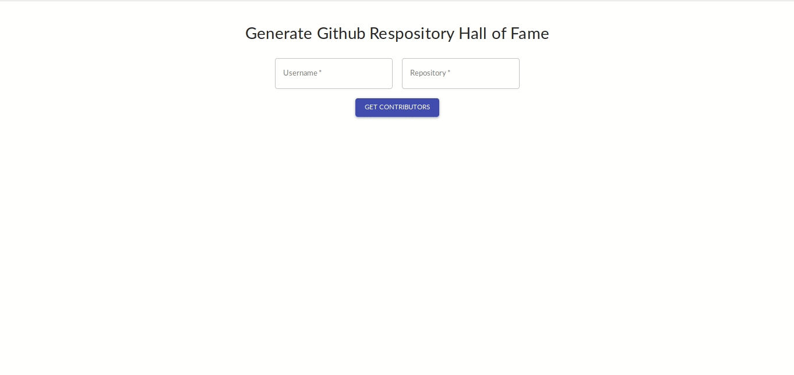

# rhof :sparkles:

Generates hall of fame for github readme using the github contributors api

> Give us a :star: if you like our work :smile:

## Sample Usage

  

## How to use

> Code is not deployed anywhere, so below are steps for local setup

- Clone the repository
  - `git clone https://github.com/arshadkazmi42/rhof`
- Go to root directory
  - `cd rhof`
- Install dependencies
  - `yarn`
- Start the application
  - `yarn start`
- This will start the application on  
  - `http://localhost:3000`

## Contributing

We are constantly working on improving the project and we need all the help we can get.

You can contribute to this project by giving [suggestions](https://github.com/arshadkazmi42/rhof/issues/new), fixing open [issues](https://github.com/arshadkazmi42/rhof/issues) or by implementing a new feature.

Read our contributing [guide](CONTRIBUTING.md) on getting started with contribution

## Contributors

Thank you to all the contributors who help in making this project better :raised_hands:

